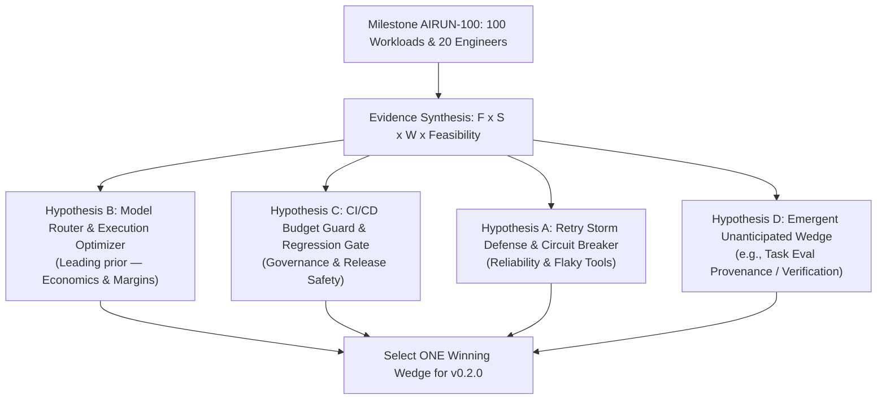

# Milestone AIRUN-100: Operating Charter & Scoreboard

> **Mission**: Profile 100 meaningfully different AI workload observations with 20 external engineers to identify the single recurring control-plane problem that teams will pay to eliminate.

---

## 1. The Scoreboard

| Dimension | Target | Current Progress | Status |
|---|---|---|---|
| **External Engineers** | **20** | 0 / 20 Onboarded | 🟡 Active Outreach |
| **Meaningfully Different Workloads** | **100** | 6 / 100 (Laboratory Baseline) | 🟡 In Progress |
| **Repeat Active Users (Weekly)** | **10** | 0 / 10 | ⚪ Pending Phase 2 |
| **Design Partners** | **3–5** | 0 / 5 | ⚪ Pending Phase 2 |
| **Recurring Pain Points Ranked** | **1** | 6 Candidate hypotheses ranked | 🟡 Formulating Signal |
| **Level 5 Economic Pull Signals** | **1** | Tracked in `signals.md` | ⚪ Pending Validation |

---

## 2. Definition of "100 Workload Observations"

A **Workload Observation** is defined as:
$$\text{Application / Domain} \times \text{Execution Strategy / Architecture} \times \text{Model / Tool Configuration}$$

*Running the same script 50 times counts as 1 workload observation with 50 samples.*

---

## 3. Workload Archetype Diversity Matrix (10 Archetypes)

- [x] **Archetype 1: Simple LLM Assistant** (`examples/lab/chat_workload.py`)
- [x] **Archetype 2: RAG Retrieval & Synthesis** (`examples/lab/rag_workload.py`)
- [x] **Archetype 3: Tool-Augmented Agent with Retries** (`examples/lab/tool_agent_workload.py`)
- [x] **Archetype 4: Coding & Debugging Loop** (`examples/lab/coding_agent_workload.py`)
- [x] **Archetype 5: Multi-Agent Coordination Pipeline** (`examples/lab/multi_agent_workload.py`)
- [x] **Archetype 6: Cost & Latency Regression / Optimization** (`examples/lab/comparison_workload.py`)
- [ ] **Archetype 7: Long-Context Multi-Turn Workflow** (Context bloat & window ballooning)
- [ ] **Archetype 8: High-Concurrency Inference** (Parallel tool calling & fan-out/join DAGs)
- [ ] **Archetype 9: Failure/Retry-Heavy Workflow** (100% wasted cost & unhandled tool errors)
- [ ] **Archetype 10: Production-Grade Asynchronous Workflow** (FastAPI / Celery background worker)

---

## 4. Signal Classification Hierarchy

| Level | Signal Type | Example User Response | Action |
|---|---|---|---|
| **Level 0** | **Compliment** | *"This looks super cool!"* | **Ignore** (Politeness noise) |
| **Level 1** | **Interest** | *"I'd like to try this on our chatbot."* | Send invitation & quickstart |
| **Level 2** | **Active Usage** | *"I ran it on our internal RAG pipeline."* | Schedule concierge debrief |
| **Level 3** | **Repeat Usage** | *"I've checked airun 4 times this week."* | **Critical signal** — observe habit formation |
| **Level 4** | **Workflow Dependency** | *"We won't deploy prompt changes without running `airun compare`."* | Candidate Design Partner |
| **Level 5** | **Economic Dependency** | *"We need this in production because it prevents $X in wasted spend."* | **Winning Commercial Wedge** |

---

## 5. Four Operating Rules During AIRUN-100

1. **Feature Freeze**: No new capability development until 100 workloads and 20 interviews are synthesized. Only validation-blocking defect fixes are permitted.
2. **Friction is Ground Truth**: Record every hesitation, pause, terminal error, or conceptual confusion in [`validation/results/friction-log.md`](file:///c:/Users/bikrams/airun-tracing/airun-tracing/validation/results/friction-log.md).
3. **Counterfactual Listening**: Always ask:
   - *"If airun disappeared tomorrow, what would you use instead?"*
   - *"If airun disappeared tomorrow, what specific capability or insight would you lose?"*
4. **The "So What?" Actionability Test**: For every finding surfaced, probe what the engineer actually did:
   - *Acted* $\to$ Candidate for automation.
   - *Investigated but couldn't fix* $\to$ Candidate for guidance/tooling.
   - *Ignored* $\to$ Noise (demote finding).

---

## 6. The 4-Candidate Decision Matrix for v0.2.0

